# DocIntel Pro — Building an Intelligent Document Processing Platform with RAG on AWS

> Turn any pile of PDFs into a searchable, AI-powered knowledge base — powered by AWS
> Textract, Amazon Bedrock, OpenSearch, and a modern TypeScript full-stack.

---

## Table of Contents

1. [What Is DocIntel Pro?](#what-is-docintel-pro)
2. [What Is RAG and Why Does It Matter?](#what-is-rag-and-why-does-it-matter)
3. [High-Level Architecture](#high-level-architecture)
4. [The Document Upload Pipeline](#the-document-upload-pipeline)
5. [Document Processing — From PDF to Vectors](#document-processing--from-pdf-to-vectors)
6. [The RAG Query Flow — Asking Questions](#the-rag-query-flow--asking-questions)
7. [Complete Data Flow — End to End](#complete-data-flow--end-to-end)
8. [Infrastructure as Code with AWS CDK](#infrastructure-as-code-with-aws-cdk)
9. [Frontend — A Modern Next.js 15 Experience](#frontend--a-modern-nextjs-15-experience)
10. [Backend — Lambda Handlers & Shared Utilities](#backend--lambda-handlers--shared-utilities)
11. [Authentication — Cognito Without Amplify](#authentication--cognito-without-amplify)
12. [Key Technical Decisions](#key-technical-decisions)
13. [Tech Stack Summary](#tech-stack-summary)

---

## What Is DocIntel Pro?

DocIntel Pro is a **full-stack serverless platform** that lets users upload PDF documents,
automatically extract and understand their contents using OCR and AI, and then **ask
natural language questions** that are answered using only the information in those
documents.

Think of it as building your own private ChatGPT — except it only answers from _your_
documents, cites its sources, and runs entirely on your AWS account.

The core workflow is simple:

1. **Upload** a PDF document into a workspace.
2. **Wait** while Textract extracts the text, Bedrock generates vector embeddings, and
   OpenSearch indexes them.
3. **Ask a question** — the system finds the most relevant passages, feeds them to Claude
   3, and returns a grounded answer with source citations.

---

## What Is RAG and Why Does It Matter?

**Retrieval-Augmented Generation (RAG)** is a technique that combines the strengths of two
AI paradigms:

- **Retrieval**: Finding the most relevant pieces of information from a knowledge base.
- **Generation**: Using a large language model (LLM) to synthesize a coherent,
  natural-language answer.

### The Problem RAG Solves

Standard LLMs like Claude or GPT are trained on public internet data up to a cutoff date.
They **don't know about your private documents** — your contracts, reports, or internal
manuals. Fine-tuning a model is expensive and impractical for frequently changing data.

### How RAG Works — Step by Step

```mermaid
flowchart TD
    Q["🧑 User Question"] --> EMBED["🧠 1 - Embed Question"]
    EMBED --> VEC["📐 Vector 1,536 dims"]
    VEC --> SEARCH["🔍 2 - Semantic Search"]

    subgraph VS["📦 Vector Store - OpenSearch"]
        C1["Chunk 1 + vector"]
        C2["Chunk 2 + vector"]
        C3["Chunk 3 + vector"]
        C4["Chunk N + vector"]
    end

    SEARCH <--> VS
    SEARCH --> RANK["📊 3 - Rank and Filter"]

    subgraph CTX["🗂️ Retrieved Context"]
        S1["S1 - Page 3: Contract expires Dec 31"]
        S2["S2 - Page 7: 90 days notice required"]
        S3["S3 - Page 12: Penalties for breach"]
    end

    RANK --> BUILD["📝 4 - Build RAG Prompt"]
    CTX --> BUILD

    subgraph PR["📋 Prompt"]
        I1["Instructions: Use ONLY sources"]
        I2["Sources: S1, S2, S3"]
        I3["Question: When does it expire?"]
    end

    PR --> LLM
    BUILD --> LLM["🤖 5 - Claude 3 Haiku"]
    LLM --> OUT["✅ 6 - Grounded Answer"]

    subgraph RES["📤 Response"]
        A1["Answer with citations S1, S2"]
        A2["Sources + similarity scores"]
        A3["Confidence: 0.92"]
    end

    OUT --> RES

    style Q fill:#e8f5e9,stroke:#2e7d32,color:#1b5e20
    style EMBED fill:#e3f2fd,stroke:#1565c0,color:#0d47a1
    style VEC fill:#f3e5f5,stroke:#7b1fa2,color:#4a148c
    style SEARCH fill:#fff3e0,stroke:#e65100,color:#bf360c
    style RANK fill:#fff3e0,stroke:#e65100,color:#bf360c
    style BUILD fill:#fce4ec,stroke:#c62828,color:#b71c1c
    style LLM fill:#ede7f6,stroke:#4527a0,color:#311b92
    style OUT fill:#e8f5e9,stroke:#2e7d32,color:#1b5e20
    style VS fill:#e0f7fa,stroke:#00838f,color:#006064
    style CTX fill:#f1f8e9,stroke:#558b2f,color:#33691e
    style PR fill:#fce4ec,stroke:#c62828,color:#b71c1c
    style RES fill:#e8f5e9,stroke:#2e7d32,color:#1b5e20
```



The key insight: **the LLM never "memorizes" your documents**. Instead, at query time, we
_retrieve_ the relevant passages and _inject_ them into the prompt. This means:

- ✅ **Always up-to-date** — new documents are searchable immediately after processing.
- ✅ **Grounded** — answers come from actual document text, reducing hallucinations.
- ✅ **Traceable** — every answer includes source citations with page numbers.
- ✅ **Secure** — your data stays in your AWS account; nothing is sent to external
  training pipelines.

---

## High-Level Architecture

The entire platform is built on AWS serverless services, orchestrated by AWS CDK.


| Layer       | Services                   | Purpose                                          |
| ----------- | -------------------------- | ------------------------------------------------ |
| **Edge**    | CloudFront                 | CDN for the Next.js frontend                     |
| **Auth**    | Cognito User Pool          | User registration, login, JWT tokens             |
| **API**     | API Gateway (REST)         | Request routing with Cognito authorizer          |
| **Compute** | Lambda Functions (×8)      | Upload, Workspace CRUD, Query, Textract handlers |
| **AI/ML**   | Bedrock (Titan + Claude 3) | Embeddings generation + answer generation        |
| **OCR**     | Textract                   | PDF text extraction                              |
| **Storage** | S3, DynamoDB               | Documents, metadata, job tracking                |
| **Search**  | OpenSearch (k-NN)          | Vector store for semantic search                 |

Every component is **serverless and pay-per-use**. There are no EC2 instances, no servers
to patch, and the system scales automatically from zero to thousands of concurrent users.

---

## The Document Upload Pipeline

When a user drags a PDF into the app, the upload is handled through a **presigned URL
pattern** — the file goes directly from the browser to S3, never touching the Lambda
function.


### How It Works

**Step 1 — Request a presigned URL:**

The frontend calls `POST /upload` with the filename and workspace ID. The Lambda handler
validates the request, creates a document metadata record in DynamoDB, and returns a
presigned S3 URL:

```typescript
// Upload Handler — generates presigned URLs for secure PDF uploads
const sanitizedFilename = sanitizeFilename(filename);
const s3Key = `${userId}/${workspaceId}/${sanitizedFilename}`;

const command = new PutObjectCommand({
  Bucket: cfg.s3.documentsBucket,
  Key: s3Key,
  ContentType: contentType,
  Metadata: {
    userId,
    documentId,
    workspaceId,
    originalFilename: filename,
  },
});

const uploadUrl = await getSignedUrl(s3Client, command, {
  expiresIn: cfg.s3.presignedUrlExpiry, // 300 seconds
});
```

**Step 2 — Upload directly to S3:**

The frontend uses `XMLHttpRequest` (not `fetch`) to PUT the file directly to S3, enabling
real-time progress tracking:

```typescript
export async function uploadToS3(
  presignedUrl: string,
  file: File,
  onProgress?: (progress: number) => void,
): Promise<void> {
  return new Promise((resolve, reject) => {
    const xhr = new XMLHttpRequest();
    xhr.upload.addEventListener('progress', (event) => {
      if (event.lengthComputable && onProgress) {
        onProgress((event.loaded / event.total) * 100);
      }
    });
    xhr.open('PUT', presignedUrl);
    xhr.setRequestHeader('Content-Type', file.type);
    xhr.send(file);
  });
}
```

**Step 3 — S3 event triggers processing:**

When the PDF lands in S3, an `ObjectCreated` event automatically triggers the
`textract-start` Lambda, kicking off the document processing pipeline.

---

## Document Processing — From PDF to Vectors

This is where the magic happens. The processing pipeline transforms a raw PDF into
searchable, AI-ready vector embeddings.


### The Pipeline — Two Lambda Functions

#### Lambda 1: `textract-start` (Triggered by S3)

When a PDF arrives in S3, this handler:

1. Validates the file (PDF type, ≤50 MB).
2. Updates the document status to `PROCESSING` in DynamoDB.
3. Starts an **asynchronous Textract job** for OCR text extraction.
4. Saves the Textract Job ID for later lookup.

```typescript
const params: StartDocumentTextDetectionCommandInput = {
  DocumentLocation: {
    S3Object: { Bucket: bucket, Name: key },
  },
  ClientRequestToken: documentId, // Idempotency
  NotificationChannel: {
    SNSTopicArn: cfg.textract.snsTopicArn,
    RoleArn: cfg.textract.roleArn,
  },
};

const result = await textractClient.send(new StartDocumentTextDetectionCommand(params));
```

#### Lambda 2: `textract-complete` (Triggered by SNS)

When Textract finishes (30 seconds to 5 minutes later), it publishes a notification to
SNS, which triggers this handler:

1. **Fetch Textract results** — paginated retrieval of all extracted text blocks.
2. **Parse** — organize blocks into pages, tables, forms, and key-value pairs.
3. **Chunk** — split text into overlapping windows (1,000 characters with 100-character
   overlap).
4. **Embed** — generate a 1,536-dimension vector for each chunk using **Amazon Titan
   Embeddings**.
5. **Index** — store each chunk + vector in **OpenSearch** for semantic search.

```typescript
// Chunk text with sliding window overlap
function chunkText(
  text: string,
  pageNumber: number,
): Array<{ text: string; pageNumber: number }> {
  const cfg = config();
  const chunks: Array<{ text: string; pageNumber: number }> = [];
  const { chunkSize, overlap } = cfg.chunking; // 1000 chars, 100 overlap

  for (let i = 0; i < text.length; i += chunkSize - overlap) {
    const chunk = text.slice(i, i + chunkSize);
    if (chunk.trim().length > 0) {
      chunks.push({ text: chunk.trim(), pageNumber });
    }
  }
  return chunks;
}

// Generate embedding using Bedrock Titan
async function generateEmbedding(text: string): Promise<number[]> {
  const response = await bedrockClient.send(
    new InvokeModelCommand({
      modelId: 'amazon.titan-embed-text-v2:0',
      body: JSON.stringify({ inputText: text }),
    }),
  );
  const result = JSON.parse(new TextDecoder().decode(response.body));
  return result.embedding; // 1,536-dimension vector
}
```

### Why Overlapping Chunks?

If you split text at hard boundaries, you risk cutting a sentence — or an important
concept — in half. The **100-character overlap** ensures that ideas spanning a chunk
boundary are captured in at least one complete chunk:

```
Document: "The contract expires on December 31, 2025. Early termination requires 90 days notice."

Chunk 1: "...The contract expires on December 31, 2025. Early termination requires 90 da..."
Chunk 2: "...on December 31, 2025. Early termination requires 90 days notice..."
                                ^^^^^^^^^^^^^^^^^^^^^^^^^^^^^^^^^^^^
                                   Overlapping region — captured in both chunks
```

---

## The RAG Query Flow — Asking Questions

When a user types a question in the chat interface, the system executes a multi-step RAG
pipeline in a single Lambda invocation.


### The 8 Steps

Here's the complete flow inside the `query.handler`:

```typescript
// Step 1: Validate the question
const { question, workspaceId } = validation.data;

// Step 2: Embed the question into the same vector space as the documents
const questionEmbedding = await embeddingSvc.embedText(question);
// → [0.0234, -0.0891, 0.1456, ...] (1,536 dimensions)

// Step 3: Hybrid search in OpenSearch (vector + keyword)
const searchResults = await vectorStoreSvc.hybridSearch(
  questionEmbedding,
  question,
  cfg.search.topK, // top 10 results
);

// Step 4: Filter by workspace
let filteredResults = workspaceId
  ? searchResults.filter((r) => r.metadata['workspaceId'] === workspaceId)
  : searchResults;

// Step 5: Filter by similarity threshold
const relevantChunks = filteredResults.filter(
  (chunk) => chunk.similarity_score >= cfg.search.similarityThreshold, // ≥ 0.5
);

// Step 6: Handle "no results" gracefully
if (relevantChunks.length === 0) {
  return successResponse({
    answer: 'I could not find any relevant documents...',
    sources: [],
    confidence: 0,
  });
}

// Step 7: Build the RAG prompt and call Claude 3 Haiku
const prompt = constructPrompt(question, relevantChunks);
const answer = await generateAnswer(prompt);

// Step 8: Return answer with sources and confidence
return successResponse({
  answer,
  sources: formatSources(relevantChunks),
  confidence: calculateConfidence(relevantChunks),
});
```

### The RAG Prompt

The prompt engineering is critical. The system instructs Claude to:

- **Only use information from the provided source excerpts** — no general knowledge.
- **Cite sources** with `[S1]`, `[S2]`, etc. for traceability.
- **Acknowledge when information is insufficient** rather than hallucinate.

```typescript
function constructPrompt(question: string, chunks: SearchResult[]): string {
  const sourceTexts = chunks
    .map((chunk, index) => {
      const sourceId = `S${index + 1}`;
      const pageInfo = chunk.metadata['page'] ? ` (Page ${chunk.metadata['page']})` : '';
      return `[${sourceId}]${pageInfo}: ${chunk.content}`;
    })
    .join('\n\n');

  return `You are a helpful AI assistant answering questions based on
provided document excerpts. Use ONLY the information from the sources below.

Guidelines:
- Answer directly and concisely
- Cite sources using [S1], [S2], etc.
- If sources don't contain enough information, say so
- Keep your answer under 500 words

Sources:
${sourceTexts}

Question: ${question}

Answer:`;
}
```

### Hybrid Search — Best of Both Worlds

The system uses **hybrid search** combining:

- **Vector search (k-NN)** — finds semantically similar chunks even if they use different
  words ("automobile" matches "car").
- **Keyword search (BM25)** — catches exact matches, names, acronyms, and numbers that
  embeddings might miss.

This combination ensures both conceptual relevance _and_ lexical precision.

---

## Complete Data Flow — End to End

The complete lifecycle — from upload to answer — spans multiple AWS services working
together asynchronously.


```
User uploads PDF
    → Browser → S3 (presigned URL)
        → S3 Event → textract-start Lambda
            → Textract (async OCR, 30s-5min)
                → SNS notification → textract-complete Lambda
                    → Bedrock Titan (embeddings per chunk)
                        → OpenSearch (vector indexing)

User asks a question
    → Browser → API Gateway → query Lambda
        → Bedrock Titan (embed question)
            → OpenSearch (hybrid k-NN search)
                → Bedrock Claude 3 (generate answer)
                    → Response with sources + confidence
```

---

## Infrastructure as Code with AWS CDK

The entire infrastructure is defined in a single CDK stack (`MinimalStack`) using
TypeScript. Here's how the key resources are wired together:

```typescript
// S3 → Lambda trigger: when a PDF is uploaded, start Textract
documentsBucket.addEventNotification(
  s3.EventType.OBJECT_CREATED,
  new s3n.LambdaDestination(textractStartHandler),
);

// SNS → Lambda trigger: when Textract finishes, process results
textractCompletionTopic.addSubscription(
  new snsSubscriptions.LambdaSubscription(textractCompleteHandler),
);

// API Gateway with Cognito Authorizer — every endpoint is protected
const authorizer = new apigateway.CognitoUserPoolsAuthorizer(this, 'Auth', {
  cognitoUserPools: [userPool],
});

// REST API endpoints
upload.addMethod('POST', new apigateway.LambdaIntegration(uploadHandler), {
  authorizer,
  authorizationType: apigateway.AuthorizationType.COGNITO,
});

query.addMethod('POST', new apigateway.LambdaIntegration(queryHandler), {
  authorizer,
  authorizationType: apigateway.AuthorizationType.COGNITO,
});
```

### OpenSearch Vector Index

A custom CDK resource automatically initializes the OpenSearch index with the correct k-NN
mapping on every deployment:

```json
{
  "settings": {
    "index.knn": true,
    "index.knn.algo_param.ef_search": 256
  },
  "mappings": {
    "properties": {
      "embedding": {
        "type": "knn_vector",
        "dimension": 1536,
        "method": {
          "name": "hnsw",
          "engine": "nmslib",
          "space_type": "cosinesimil"
        }
      }
    }
  }
}
```

This uses **HNSW (Hierarchical Navigable Small World)** — an approximate nearest neighbor
algorithm that achieves sub-millisecond search times even with millions of vectors.

---

## Frontend — A Modern Next.js 15 Experience

The frontend is a **single-page application** built with Next.js 15 (App Router), React
18, TanStack Query v5, and Tailwind CSS.

### Component Architecture

```
Providers
  └─ QueryClientProvider (TanStack — data caching)
       └─ AuthProvider (Cognito session management)
            └─ WorkspaceProvider (selected workspace state)
                 └─ HomePage
                      ├─ AuthForm (login / register / confirm email)
                      ├─ WorkspaceSelector (create, switch, edit, delete)
                      ├─ FileUpload (drag-and-drop with progress)
                      ├─ DocumentManagement (list + status badges)
                      └─ ChatInterface (RAG conversation UI)
```

### The Chat Interface

The chat component renders messages in a scrollable container with color-coded confidence
badges on source citations:

- 🟢 **Green** — similarity ≥ 85% (high confidence)
- 🟡 **Yellow** — similarity ≥ 70% (moderate confidence)
- ⚪ **Grey** — similarity below 70% (low confidence)

Users see exactly _which_ document passages informed each answer and how confident the
match is.

### Data Fetching with TanStack Query

All API interactions go through custom hooks that use TanStack Query for caching,
background refetching, and optimistic updates:

```typescript
// Every API call flows through this pattern:
// Component → Custom Hook → getIdToken() (auto-refresh) → fetch()
const idToken = await getIdToken();
const response = await fetch(`${API_BASE_URL}/query`, {
  method: 'POST',
  headers: {
    'Content-Type': 'application/json',
    Authorization: `Bearer ${idToken}`,
  },
  body: JSON.stringify({ question, workspaceId }),
});
```

---

## Backend — Lambda Handlers & Shared Utilities

Each API endpoint is backed by a dedicated Lambda function. To avoid code duplication
across 8+ handlers, all shared concerns are centralized:

### Shared Module Structure

```
handlers/
  shared/
    config.ts      → Centralized environment variable access
    clients.ts     → Lazy-initialized AWS SDK clients (singleton per container)
    auth.ts        → Extract user identity from API Gateway events
    responses.ts   → Consistent HTTP response formatting with CORS
    logger.ts      → Structured logging with Pino
    index.ts       → Re-exports everything
```

### Centralized Configuration

Every Lambda reads its settings from a single `config()` function — cached per container:

```typescript
export const config = (): HandlerConfig => {
  if (!configInstance) {
    configInstance = {
      aws: { region: process.env['AWS_REGION'] || 'us-east-1' },
      s3: { documentsBucket: process.env['S3_DOCUMENTS_BUCKET'] || '' },
      bedrock: {
        embeddingModelId: 'amazon.titan-embed-text-v2:0',
        llmModelId: 'anthropic.claude-3-haiku-20240307-v1:0',
        temperature: 0.3,
        maxTokens: 500,
      },
      search: { topK: 10, similarityThreshold: 0.5 },
      chunking: { chunkSize: 1000, overlap: 100 },
      // ... all environment variables in one place
    };
  }
  return configInstance;
};
```

### Lazy-Initialized AWS Clients

AWS SDK clients are instantiated **once per Lambda container** and reused across warm
invocations:

```typescript
let dynamoClient: DynamoDBClient | null = null;

export const getDynamoClient = (): DynamoDBClient => {
  if (!dynamoClient) {
    dynamoClient = new DynamoDBClient({ region: config().aws.region });
  }
  return dynamoClient;
};
```

### Consistent Response Formatting

All handlers use shared response helpers that automatically include CORS headers:

```typescript
export const successResponse = <T>(data: T, statusCode = 200): APIGatewayProxyResult => ({
  statusCode,
  headers: {
    'Content-Type': 'application/json',
    'Access-Control-Allow-Origin': '*',
    'Access-Control-Allow-Headers': 'Content-Type,Authorization',
    'Access-Control-Allow-Methods': 'GET,POST,PUT,PATCH,DELETE,OPTIONS',
  },
  body: JSON.stringify(data),
});

// Shortcut helpers
export const unauthorized = (msg = 'User not authenticated') =>
  errorResponse(401, 'Unauthorized', msg);

export const notFound = (msg = 'Resource not found') =>
  errorResponse(404, 'Not Found', msg);
```

---

## Authentication — Cognito Without Amplify

A notable technical decision: the frontend uses the **raw AWS SDK**
(`@aws-sdk/client-cognito-identity-provider`) for authentication — **no AWS Amplify
dependency**.

This keeps the bundle small and gives full control over the auth flow:

```typescript
import {
  CognitoIdentityProviderClient,
  InitiateAuthCommand,
  SignUpCommand,
} from '@aws-sdk/client-cognito-identity-provider';

const cognitoClient = new CognitoIdentityProviderClient({
  region: process.env['NEXT_PUBLIC_COGNITO_REGION'] || 'us-east-1',
});

// Sign in: USER_PASSWORD_AUTH flow → returns JWT tokens
export async function signIn(email: string, password: string): Promise<AuthTokens> {
  const command = new InitiateAuthCommand({
    AuthFlow: 'USER_PASSWORD_AUTH',
    ClientId: CLIENT_ID,
    AuthParameters: { USERNAME: email, PASSWORD: password },
  });

  const result = await cognitoClient.send(command);
  return {
    idToken: result.AuthenticationResult!.IdToken!,
    accessToken: result.AuthenticationResult!.AccessToken!,
    refreshToken: result.AuthenticationResult!.RefreshToken!,
    expiresAt: Date.now() + result.AuthenticationResult!.ExpiresIn! * 1000,
  };
}
```

The `AuthProvider` context handles:

- **Session restoration** from `localStorage` on page load.
- **Automatic token refresh** — schedules a `setTimeout` 5 minutes before token expiry.
- **Transparent `getIdToken()`** — every API call gets a valid token without manual
  refresh logic.

---

## Key Technical Decisions

| Decision                     | Rationale                                                                                                 |
| ---------------------------- | --------------------------------------------------------------------------------------------------------- |
| **Presigned URL uploads**    | Files go directly from browser → S3. Lambda never handles file bytes, saving memory and time.             |
| **Async Textract via SNS**   | OCR can take minutes. The async pattern (start → SNS → complete) avoids Lambda timeouts.                  |
| **Overlapping text chunks**  | 100-char overlap prevents splitting important concepts across chunk boundaries.                           |
| **Hybrid search**            | Combines semantic (k-NN) and lexical (BM25) search for both conceptual and exact-match retrieval.         |
| **Cognito without Amplify**  | Raw AWS SDK keeps the bundle small (~50 KB vs ~500 KB for Amplify) with full control.                     |
| **Singleton Lambda clients** | AWS SDK clients are reused across warm invocations, avoiding re-initialization overhead.                  |
| **CDK for IaC**              | Single TypeScript stack defines all 13+ resources with proper IAM permissions and event wiring.           |
| **Workspace isolation**      | Every document and query is scoped to a workspace, enabling multi-tenant data separation.                 |
| **Pino structured logging**  | JSON logs with correlation IDs (`requestId`) enable fast debugging across distributed Lambda invocations. |

---

## Tech Stack Summary

### Backend

| Technology         | Purpose                                                            |
| ------------------ | ------------------------------------------------------------------ |
| **Node.js 20**     | Lambda runtime                                                     |
| **TypeScript 5.7** | Type safety across the monorepo                                    |
| **NestJS 10.4**    | Service dependency injection for Embedding and VectorStore modules |
| **AWS SDK v3**     | Modular imports — only bundle what you use                         |
| **Pino 9.x**       | Structured JSON logging                                            |
| **Vitest**         | Fast unit tests (143 passing)                                      |
| **esbuild**        | Lambda bundling — sub-second builds                                |

### Frontend

| Technology               | Purpose                                     |
| ------------------------ | ------------------------------------------- |
| **Next.js 15**           | App Router, static export to S3/CloudFront  |
| **React 18.3**           | UI rendering                                |
| **TanStack Query v5**    | Data fetching, caching, background refetch  |
| **Tailwind CSS**         | Utility-first styling                       |
| **Radix UI + shadcn/ui** | Accessible, composable component primitives |
| **Lucide React**         | Consistent iconography                      |

### Infrastructure

| Technology                   | Purpose                                        |
| ---------------------------- | ---------------------------------------------- |
| **AWS CDK v2**               | Infrastructure as Code (TypeScript)            |
| **Lambda**                   | 8 serverless functions                         |
| **API Gateway (REST)**       | Request routing + Cognito authorizer           |
| **Cognito**                  | User authentication + JWT tokens               |
| **S3**                       | Document storage + static web hosting          |
| **CloudFront**               | CDN for the frontend                           |
| **DynamoDB**                 | Document metadata, workspaces, processing jobs |
| **Textract**                 | PDF text extraction (OCR)                      |
| **Bedrock — Titan**          | Text embedding model (1,536 dimensions)        |
| **Bedrock — Claude 3 Haiku** | LLM for answer generation                      |
| **OpenSearch**               | Vector store with k-NN search                  |
| **SNS**                      | Async event notifications                      |
| **GitHub Actions**           | CI/CD pipeline                                 |

---

_DocIntel Pro demonstrates that building a production-grade, AI-powered document
intelligence platform doesn't require a fleet of servers or a massive engineering team.
With the right architecture — serverless compute, managed AI services, and modern
TypeScript tooling — a small team can ship a RAG system that is secure, scalable, and
genuinely useful._
