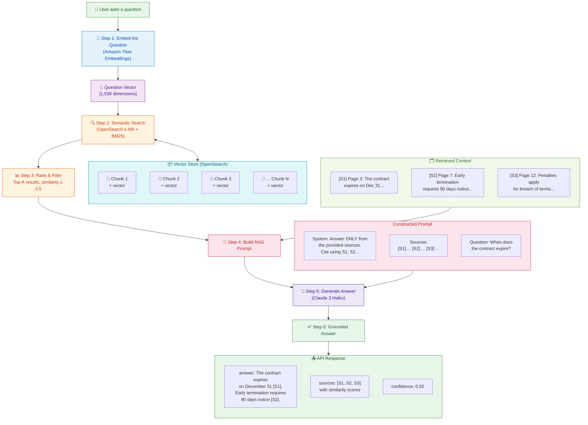

```mermaid
flowchart TD
    Q["🧑 User asks a question"] --> EMBED["🧠 Step 1: Embed the Question\n(Amazon Titan Embeddings)"]
    EMBED --> VEC["📐 Question Vector\n[1,536 dimensions]"]
    VEC --> SEARCH["🔍 Step 2: Semantic Search\n(OpenSearch k-NN + BM25)"]

    subgraph VECTORSTORE["📦 Vector Store (OpenSearch)"]
        direction TB
        C1["📄 Chunk 1\n+ vector"]
        C2["📄 Chunk 2\n+ vector"]
        C3["📄 Chunk 3\n+ vector"]
        CN["📄 ... Chunk N\n+ vector"]
    end

    SEARCH <--> VECTORSTORE
    SEARCH --> RANKED["📊 Step 3: Rank & Filter\nTop-K results, similarity ≥ 0.5"]
    RANKED --> PROMPT["📝 Step 4: Build RAG Prompt"]

    subgraph CONTEXT["🗂️ Retrieved Context"]
        direction TB
        S1["[S1] Page 3: The contract\nexpires on Dec 31..."]
        S2["[S2] Page 7: Early termination\nrequires 90 days notice..."]
        S3["[S3] Page 12: Penalties apply\nfor breach of terms..."]
    end

    CONTEXT --> PROMPT
    PROMPT --> LLM["🤖 Step 5: Generate Answer\n(Claude 3 Haiku)"]

    subgraph PROMPTBOX["Constructed Prompt"]
        direction TB
        SYS["System: Answer ONLY from\nthe provided sources.\nCite using S1, S2..."]
        SOURCES["Sources:\n[S1] ... [S2] ... [S3] ..."]
        UQUES["Question: When does\nthe contract expire?"]
    end

    PROMPTBOX --> LLM
    LLM --> ANSWER["✅ Step 6: Grounded Answer"]

    subgraph RESPONSE["📤 API Response"]
        direction TB
        ANS["answer: The contract expires\non December 31 [S1].\nEarly termination requires\n90 days notice [S2]."]
        SRC["sources: [S1, S2, S3]\nwith similarity scores"]
        CONF["confidence: 0.92"]
    end

    ANSWER --> RESPONSE

    style Q fill:#e8f5e9,stroke:#2e7d32,color:#1b5e20
    style EMBED fill:#e3f2fd,stroke:#1565c0,color:#0d47a1
    style VEC fill:#f3e5f5,stroke:#7b1fa2,color:#4a148c
    style SEARCH fill:#fff3e0,stroke:#e65100,color:#bf360c
    style RANKED fill:#fff3e0,stroke:#e65100,color:#bf360c
    style PROMPT fill:#fce4ec,stroke:#c62828,color:#b71c1c
    style LLM fill:#ede7f6,stroke:#4527a0,color:#311b92
    style ANSWER fill:#e8f5e9,stroke:#2e7d32,color:#1b5e20
    style VECTORSTORE fill:#e0f7fa,stroke:#00838f,color:#006064
    style CONTEXT fill:#f1f8e9,stroke:#558b2f,color:#33691e
    style PROMPTBOX fill:#fce4ec,stroke:#c62828,color:#b71c1c
    style RESPONSE fill:#e8f5e9,stroke:#2e7d32,color:#1b5e20
```
